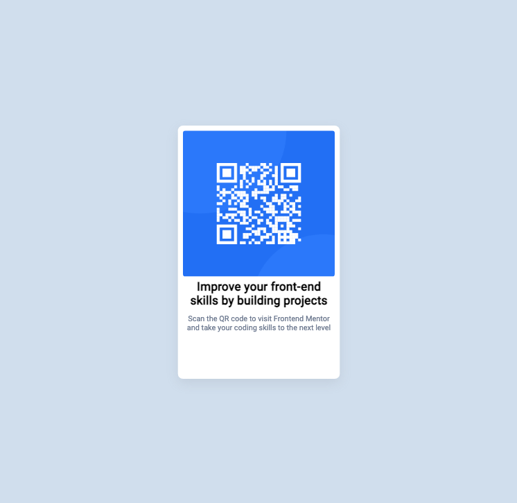

# Frontend Mentor - QR code component solution

This is a solution to the [QR code component challenge on Frontend Mentor](https://www.frontendmentor.io/challenges/qr-code-component-iux_sIO_H). Frontend Mentor challenges help you improve your coding skills by building realistic projects.

## Table of contents

- [Frontend Mentor - QR code component solution](#frontend-mentor---qr-code-component-solution)
  - [Table of contents](#table-of-contents)
  - [Overview](#overview)
    - [Screenshot](#screenshot)
    - [Links](#links)
  - [My process](#my-process)
    - [Built with](#built-with)
    - [What I learned](#what-i-learned)
    - [Continued development](#continued-development)
    - [Useful resources](#useful-resources)
  - [Author](#author)


## Overview

### Screenshot



### Links

- Solution URL: [QR Code Component Github Repo](https://github.com/brightdevs/qr-code-component-main)
- Live Site URL: [QR Code Component Github live site](https://brightdevs.github.io/qr-code-component-main/)

## My process

### Built with

- Semantic HTML5 markup
- CSS custom properties
- Flexbox
- SASS
- nodemon
- GoLive Server

### What I learned

What I learned from this project:
* Starting with a clean slate, I learned how to use the Semantic HTML5 markup and CSS custom properties.
* How to use `node-sass` to compile SASS files to CSS.
* Working with `GoLive Server` to serve the HTML and CSS files while working on it.
* Using the BEM methodology to structure the HTML and CSS.

Code snippets from the project that helped me learn:

Utilizing my variables to keep track of clean code:

```scss

$fw_400: 400;
$fw_700: 700;
$fs_body: 15px;
$light-gray: hsl(212, 45%, 89%);
$grayish-blue: hsl(220, 15%, 55%);
$dar-kblue: hsl(218, 44%, 22%);
$white: hsl(0, 0%, 100%);

```


### Continued development

After this challege the idea to create a QR code generator with React came to mind, so the final version can be viewed on [Bright Devs](https://brightdevs.com/#/projects/qr-code-generator).
This challenges have helped me by developing speed when thinking, planning projects and growing my skills in frontend development.
Very cool to see how much I can learn in a short time.

### Useful resources

- [SASS](https://sass-lang.com/) - Always a good reference when coding :).
- [node-sass](https://blog.devgenius.io/use-sass-on-your-plain-html-css-js-projects-4f09de547f8a) - This is an amazing article which helped me finally understand how to set up my environment.


## Author

- Website - [Edgar Rojas](brightdevs.com)
- Frontend Mentor - [@brightdevs](https://www.frontendmentor.io/profile/brightdevs)
- Twitter - [@bright_devs](https://www.twitter.com/bright_devs)
- GitHub - [@brightdevs](https://www.github.com/brightdevs)
